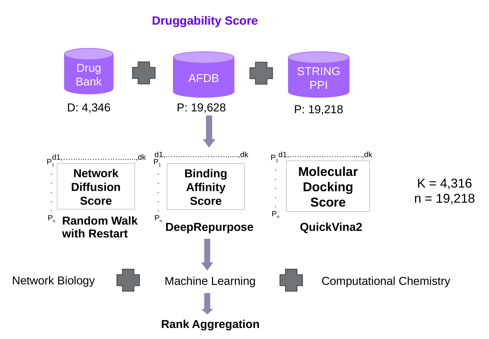

# Druggability
Consensus of ML, Computational Biology and Chemistry approaches for druggability of FDA approved drugs against all human proteins.

Goal is to obtains druggability scores for approximately 4,200 FDA approved drugs against ~20k human proteins where sequence is available from UniProt and structure obtained from [AlphaFold Database](https://alphafold.ebi.ac.uk/).

## Data Folder Organization:

### Number of unique drugs with their status and having at least 1 target, transporter or enzyme associated
drugs.csv --> 7485 such drugs with metadata information (id,drugname,drug_type,approved,experimental,illicit,investigational,nutraceutical,withdrawn)

### Proteins interacting with drugs either as target, enzyme or transporter
partner_protein.csv --> 4,632 such targets with metadata information (partner_id,partner_name,gene_name,uniprot_id,genbank_gene_id,genbank_protein_id,hgnc_id,organism,taxonomy_id)

### Protein interacting with drugs either as target, enzyme or transporter and organism associated is Human
partner_protein_human.csv --> 3,033 such targets with metadata information (partner_id,partner_name,gene_name,uniprot_id,genbank_gene_id,genbank_protein_id,hgnc_id,organism,taxonomy_id)

### MoA of all drugs
drug_MOA_Description.csv --> 24,855 such entires with metadata (id | name | description | indication | pharmacodynamics | mechanism_of_action | protein_binding | toxicity). All the metadata is in text format and makes a good resource for cross-modal RAG models i.e. image or SMILES of drug along with toxicity/moa as text as input and finding MOA or toxicity of analog of the drug

### Drug-target information
drug2target.csv --> 18,137 drug-target interactions independent of species with metadata information (id,partner_id,gene_name,inhibitor,antagonist,agonist)

### Drug-target information for humans
drug2target_human.csv --> 14,576 drug-target interactions with human targets along with metadata information (id,partner_id,gene_name,inhibitor,antagonist,agonist)

### Drug-enzyme information
drug2enzyme.csv --> 4,929 drug-enzyme interactions independent of species along with metadata information (id,partner_id,gene_name,inhibitor,antagonist,agonist)

### Drug-enyzme information for humans
drug2enzyme_human.csv --> 4,870 drug-enyzme interactions with human enxymes along with metadata information (id,partner_id,gene_name,inhibitor,antagonist,agonist)

### Drug-transported information
drug2transporter.csv --> 2,745 drug-transporter interactions independent of species along with metadata information (id,partner_id,gene_name,inhibitor,antagonist,agonist)

### Drug-transported information
drug2transporter_human.csv --> 2,728 drug-transporter interactions independent of species along with metadata information (id,partner_id,gene_name,inhibitor,antagonist,agonist)

### Drug smiles information
smiles.csv --> Drugs with SMILES representations along with metadata information about calculated properties (id|name|cas|smiles|logP ALOGPS|logP ChemAxon|solubility ALOGPS|pKa (strongest acidic)|pKa (strongest basic))

### StringDB interactions
StringDB_interactions.csv --> Protein - Protein interaction network  obtained from String PPI with confidence score >=400

### StringDB proteins
StringDB_protein_info.csv --> Protein along with metadata information for all proteins available via StringDB and present in the interaction network (#string_protein_id | preferred_name | protein_size )

### Alphafold uniprot ids
AlphaFold_UniProtIDs.csv --> Uniprot ids of proteins with structure predicted by AlphaFold2.

### AlphaFold UnitProtKB
Curated_AlphaFold_UniProtKB.csv -->  Uniprot id, gene name, details ...

### subset StringDB interactions
subset_StringDB_interactions.csv --> Protein -  Protein interaction network of genes which have a mapped UniProtId in AlphaFold Database

### subset String proteins
subset_String_protein_info.csv --> Protein along with metadata information for all proteins available via StringDB and mapped to UniProtId in Alphafold Database and present in the interaction network (#string_protein_id | preferred_name | protein_size)

### Filtered Alphafold Database
Filtered_AlphaFold_UniProtKB.csv --> Uniprot Ids of proteins in AlphaFold Database matching with at least one gene in StringDB.

### Filtered AlphaFold Database with Sequence
Filtered_AlphaFold_UniProtKB_with_Sequence.csv --> Uniprot Ids of proteins in AlphaFold Database with their AA sequence

### Filtered AlphaFold Database with Duplicate Sequence
Filtered_AlphaFold_UniProtKB_with_Duplicate_Sequence.csv --> Uniprot information of proteins with the same AA sequence

### StringDB genes AlphaFold Mapping
StringDB_genes_AlphaFold_mapping.csv --> StringDB genes and their mapping to AlphaFold Database Uniprot Ids.

### drug sdfs
drug_sdfs --> Folder contains 3d structure of all drugs in dataset generated using RDKit.

### Protein Fasta
UP000005640_9606.fasta --> Fasta file containing protein sequence of all AlphaFold Database proteins

## Models Folder:

Contains 18 different machine learning models from [DeepPurpose](https://github.com/kexinhuang12345/DeepPurpose) library 

## Results Folder:

1. ML_virtual_screenings - Contains consensus result of 18 different ML models predict protein-drug interaction
2. Propagation_scores - Contains protein-drug interaction scores using network-based diffusion approach.
3. Docking_scores - Contains docking scores for proteins with drugs as ligands using QuickVina2-GPU-2-1

## Scripts Folder:

### For Network-Diffusion Scoring

1. 
parse_drug_xml.py --> Parses the DrugBank XML database to identify and filter human protein targets for FDA approved drugs (filter).  
			    Outputs: *Drug Id*, *Partner Id (Target)*, *Gene Name*, *Inhibitor*, *Antagonist*, *Agonist* 

2. 
